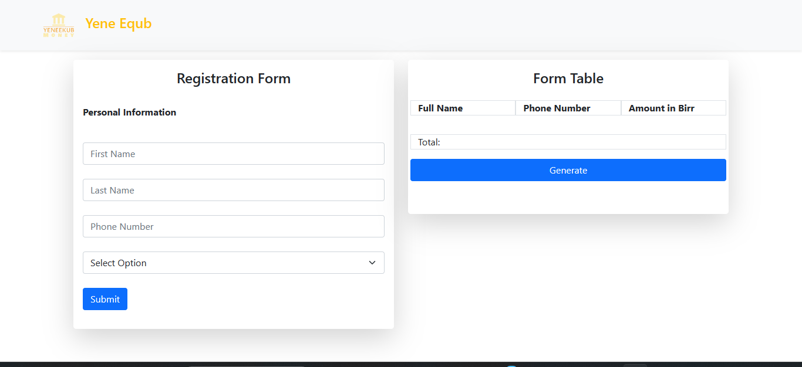

# Equb Website

> In this project, I aim to demonstrate how the website works, and we will discuss DOM (Document Object Model) manipulation and Event concepts.
> 

## What is Equb Website

Equb is an association of people in Ethiopian culture with the aim of mobilizing resources, especially finance, and distributing them on a rotating basis. It is distinguished from Eder by duration of time; Equb is temporary or permanent, while Eder is a long-term association.

Previously, all operations were done manually, including choosing the winner, and it was also difficult to calculate how much money they had.

However, in this small project, I attempt to solve this problem by transforming the manual system into a digital one. Moreover, you don't have to worry about who the winner is as it is chosen randomly.

## How the System Works

To develop this project, I mainly used HTML and JavaScript, and I used a framework called Bootstrap 5.

- **Bootstrap 5:** is the most popular CSS Framework for developing responsive and mobile-first websites.



As we can see this is the design ([Yene Equb | Home Page (mikemebrate.github.io)](https://mikemebrate.github.io/EqubWebSite/index.html)) or you could use the link, there is a registration form to record new users data and form table about existing users data who is registered early and the last one is generate button to choice the random winner. I’ll show you step by step.

First we design through HTML and the functionality in JavaScript mostly this discussion about JavaScript.

- As we can see there are input fields to accept data from the users, we should to give ID to get elements uniquely example

```html
<input type="text" class="form-control" placeholder="First Name" name="" id="fname" />
```

In this input we gave id (fname)

- **What is DOM**

HTML document is structured as a JavaScript Object. Every HTML element has a different properties which can help to manipulate it. It is possible to get, create, append or remove HTML elements using JavaScript. Check the examples below. Selecting HTML element using JavaScript is similar to selecting using CSS. To select an HTML element, we use tag name, id, class name or other attributes.

### Getting an element by id

***getElementsById()*** targets a single HTML element. We pass the id without # as an argument.

```jsx
//syntax
document.getElementById('id')

let firstTitle = document.getElementById('first-title')
console.log(firstTitle) /
```

reference: [Asabeneh/30-Days-Of-JavaScript: 30 days of JavaScript programming challenge is a step-by-step guide to learn JavaScript programming language in 30 days. This challenge may take more than 100 days, please just follow your own pace. (github.com)](https://github.com/Asabeneh/30-Days-Of-JavaScript)

- **What is Event**

Events are **things that happen in the system you are programming, which the system tells you about so your code can react to them**
. For example, if the user clicks a button on a webpage, you might want to react to that action by displaying an information box.

After we gave ID now let move to the JavaScript 

# Mouse Events

| Attribute | Value | Description |
| --- | --- | --- |
| https://www.w3schools.com/tags/ev_onclick.asp | script | Fires on a mouse click on the element |
| https://www.w3schools.com/tags/ev_ondblclick.asp | script | Fires on a mouse double-click on the element |
| https://www.w3schools.com/tags/ev_onmousedown.asp | script | Fires when a mouse button is pressed down on an element |
| https://www.w3schools.com/tags/ev_onmousemove.asp | script | Fires when the mouse pointer is moving while it is over an element |
| https://www.w3schools.com/tags/ev_onmouseout.asp | script | Fires when the mouse pointer moves out of an element |
| https://www.w3schools.com/tags/ev_onmouseover.asp | script | Fires when the mouse pointer moves over an element |
| https://www.w3schools.com/tags/ev_onmouseup.asp | script | Fires when a mouse button is released over an element |
| onmousewheel | script | Deprecated. Use the https://www.w3schools.com/tags/ev_onwheel.asp attribute instead |
| https://www.w3schools.com/tags/ev_onwheel.asp | script | Fires when the mouse wheel rolls up or down over an element |
- The most popular mouse event is onclick.

first create global variable of array which used to store the data. Which is helps us to print the winner. 

```jsx
var globalFname = new Array();
var globalPhone = new Array();
var globalAmount = new Array();
```

- How do we store uses data

Now we have to make a function that the function is triggered when the user clicks register button automatically send the data to the global variables.

```jsx
    var fname = document.getElementById("fname");
    var lname = document.getElementById("lname");
    var phonoNumber = document.getElementById("pnumber");
    var amount = document.getElementById("moneyOption");
```

Then we push through push function

```jsx
        globalFname.push(fname.value + " " + lname.value);
        globalPhone.push(phonoNumber.value);
        globalAmount.push(amount.options[amount.selectedIndex].value);
```

The last One is about generate button still we should use generate function to triggered.

```jsx
var ran = Math.floor(Math.random() * globalFname.length);
```

this Math.floor and Math.random are built system to select random man.

### Conclusion

This document describes a project that aims to transform a manual system for an Ethiopian cultural association called Equb into a digital one using HTML, JavaScript, and Bootstrap 5. The document discusses DOM manipulation and Event concepts, including how to select HTML elements using JavaScript and how to react to user actions such as mouse clicks. The project includes a registration form, a table of registered users, and a button to randomly select a winner from the registered users.
